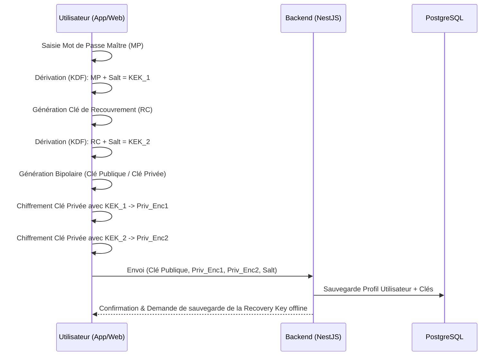
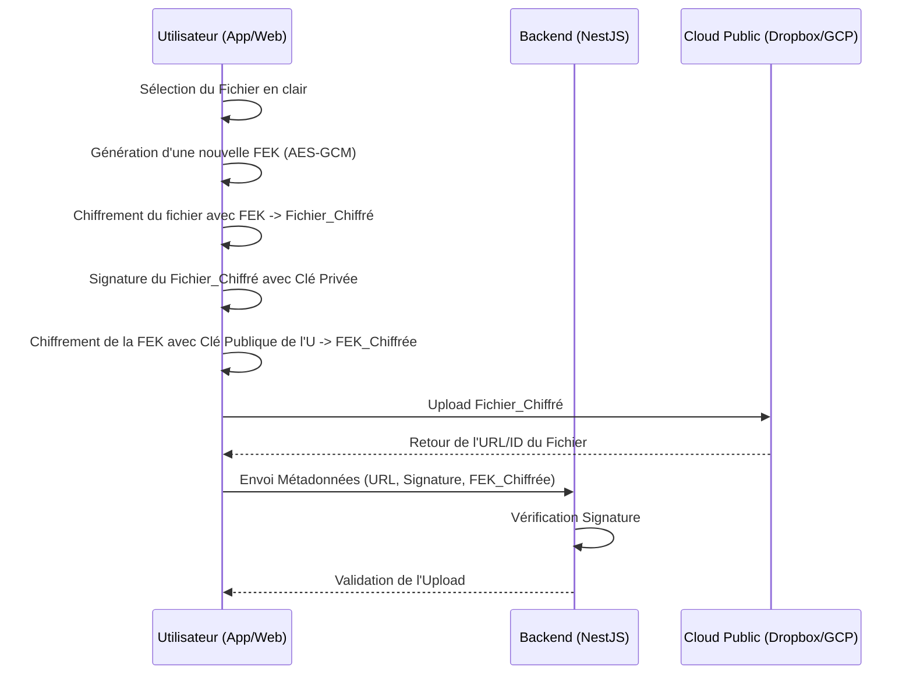
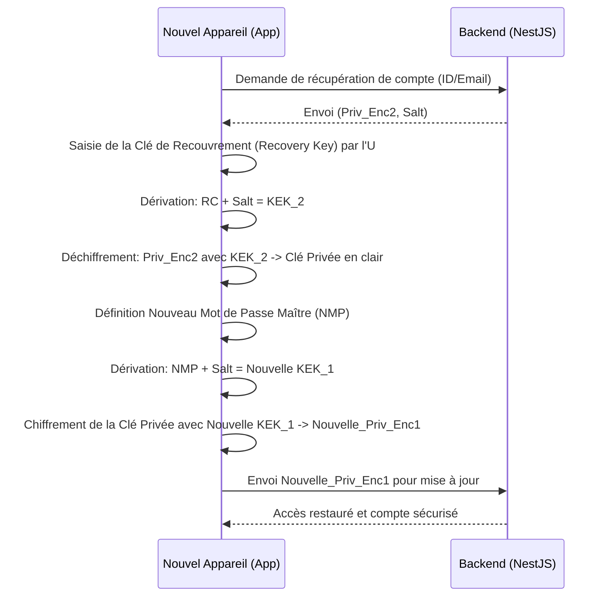

# 🛡️ Blind Storage

## Objectifs
* **Zero Knowledge :** L'application ou le cloud provider ne doivent jamais avoir accès aux données en clair ni aux clés privées des utilisateurs ni aux fichiers déchiffrés.
* **Multi-plateforme :** API RESTful pour les applications Web et Mobile.
* **Gestion multi-terminaux :** Synchronisation sécurisée de l'accès aux documents sur plusieurs appareils liés à un seul compte.
* **Partage sécurisé :** Permettre le partage de fichiers entre utilisateurs avec des droits d'accès granulaires.
* **Intégration Cloud :** Utilisation de services de stockage tiers (Dropbox, Google Cloud, etc.) pour héberger les fichiers chiffrés.
* **Gestion des droits d'accès :** Implémentation d'un système de permissions pour contrôler qui peut voir ou éditer les fichiers.
* **Résilience :** Implémentation d'une solution de recouvrement en cas de perte d'un terminal.

---

## 🏗️ Architecture Technique

L'architecture est pensée pour séparer la gestion des métadonnées/clés publiques (gérées par notre Backend) du stockage des fichiers chiffrés (délégué aux Clouds Publics).

* **Backend / API :** NestJS (Node.js). Il sert d'interface entre les applications clientes et la base de données. Il ne voit jamais les données en clair ni les clés privées déchiffrées.
* **Base de Données :** PostgreSQL avec l'ORM Prisma.
* **Stockage de Fichiers :** Intégration via API aux fournisseurs de Clouds Publics (Dropbox, Google Cloud, etc.).

---

## 🔐 Modèle Cryptographique (Zero Knowledge)

La sécurité repose sur une combinaison de cryptographie symétrique (pour la performance) et asymétrique à clé publique (pour le partage et la gestion des identités).

1.  **Chiffrement des Fichiers (Sélectif) :** Chaque fichier est chiffré avec l'algorithme **AES-GCM** à l'aide d'une clé unique appelée **FEK** (File Encryption Key).
2.  **Renouvellement des Clés :** La FEK est renouvelée à chaque modification des droits d'accès d'un fichier.
3.  **Intégrité :** Chaque utilisateur signe cryptographiquement le fichier à chaque modification (édit).
4.  **Gestion des Clés Utilisateurs :** * Le backend stocke et distribue les **clés publiques**.
    * Le backend stocke la **clé privée**, mais celle-ci est **fortement chiffrée**.
5.  **Protection de la Clé Privée (KEK - Key Encryption Key) :** La clé privée est stockée chiffrée sous deux formes différentes sur le serveur :
    * Chiffrée via une KEK dérivée du **Mot de Passe Maître (MP) + Salt** de l'utilisateur.
    * Chiffrée une seconde fois via une KEK dérivée d'une **Clé de Recouvrement** (Recovery Key) générée à l'inscription, que l'utilisateur doit conserver hors ligne.

---

## 📊 Schémas des Flux d'Architecture

### 1. Inscription et Génération des Clés

Ce flux garantit que le serveur ne connaît jamais la clé privée de l'utilisateur.



### 2. Upload et Chiffrement d'un Fichier

Ce flux illustre le chiffrement local avant l'envoi sur le cloud public.



### 3. Récupération de Compte (Perte de Terminal)

Conformément à la tâche 4 du projet, ce flux montre comment un utilisateur récupère son accès s'il perd son appareil et son mot de passe.



---

## 🚀 Get Started

### Prérequis

- [Node.js](https://nodejs.org/) >= 20
- [Docker](https://www.docker.com/) & Docker Compose

### Installation

```bash
# 1. Cloner le dépôt
git clone https://github.com/thomas-cad/blind-storage.git
cd blind-storage/back

# 2. Installer les dépendances
npm install

# 3. Configurer les variables d'environnement
cp .env.example .env
# Éditer .env
```

### Lancer la base de données

```bash
# Depuis la racine du projet
docker compose up -d
```

### Lancer le backend

```bash
# Développement
npm run start:dev

# Production
npm run build
npm run start:prod
```

L'API est disponible sur `http://localhost:3000` (ou le `PORT` défini dans `.env`).

### Variables d'environnement

| Variable          | Description                          | Défaut      |
| ----------------- | ------------------------------------ | ----------- |
| `PORT`            | Port d'écoute du serveur NestJS      | `3000`      |
| `POSTGRES_USER`   | Utilisateur PostgreSQL               | —           |
| `POSTGRES_PASSWORD` | Mot de passe PostgreSQL            | —           |
| `POSTGRES_DB`     | Nom de la base de données            | —           |
| `POSTGRES_PORT`   | Port exposé par le conteneur         | `5432`      |
| `DATABASE_URL`    | URL de connexion Prisma              | —           |

---

## Contributeurs 
* **Thomas Cadegros** - Etudiant cycle ingénieur spécialisé en cybersécurité à Télécom Paris - [mailto:thomas.cadegros@telecom-paris.fr](mailto:thomas.cadegros@telecom-paris.fr)
* **Amine Slaoui** - Etudiant cycle ingénieur spécialisé en cybersécurité à Télécom Paris - [mailto:amine.slaoui@telecom-paris.fr](mailto:amine.slaoui@telecom-paris.fr)