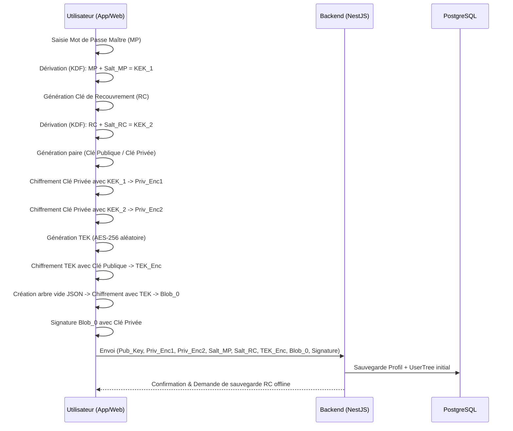
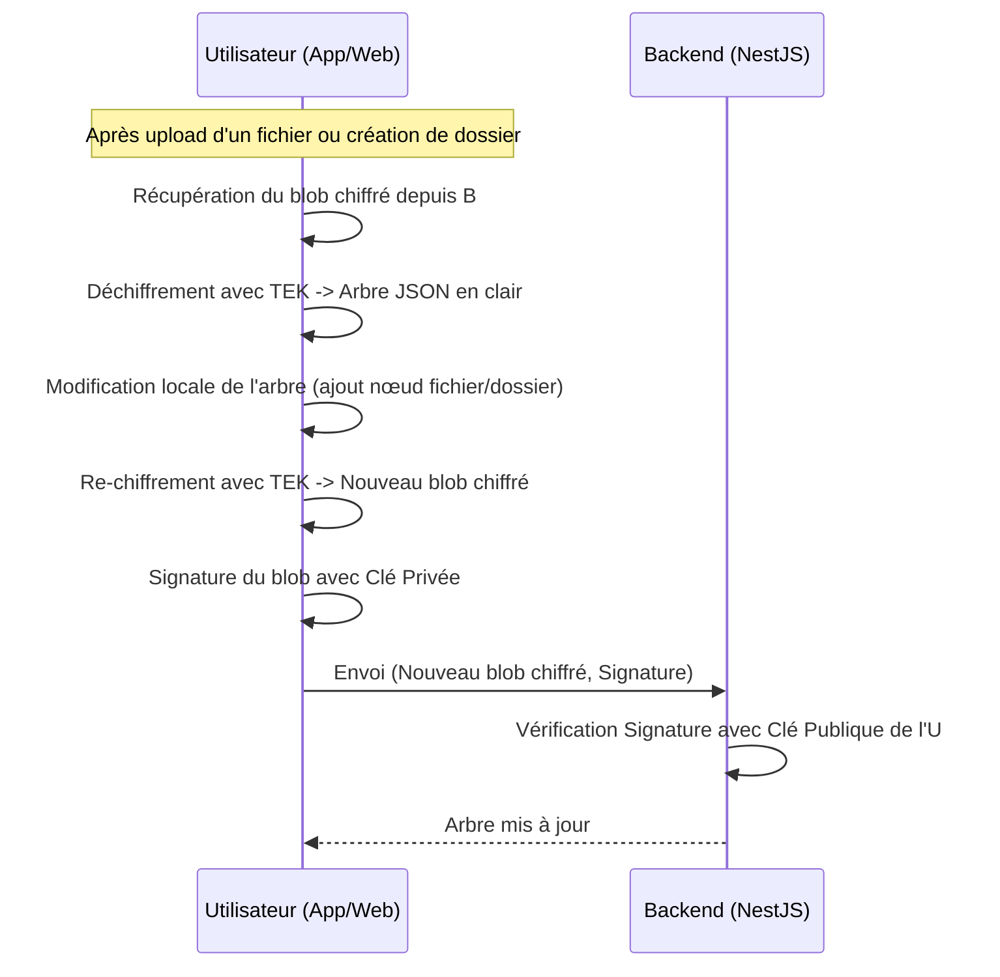
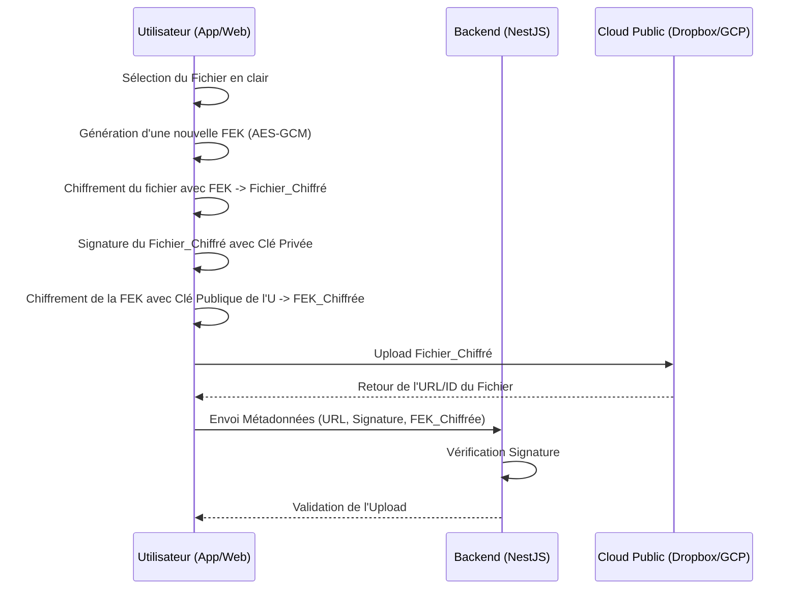
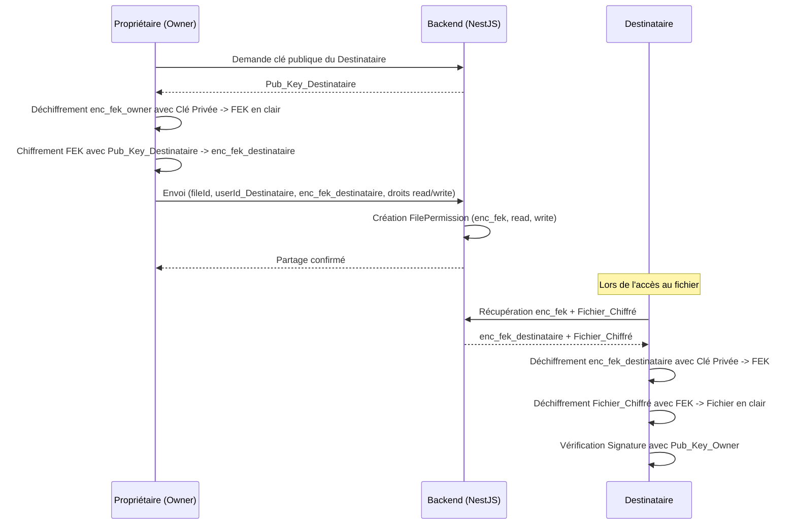
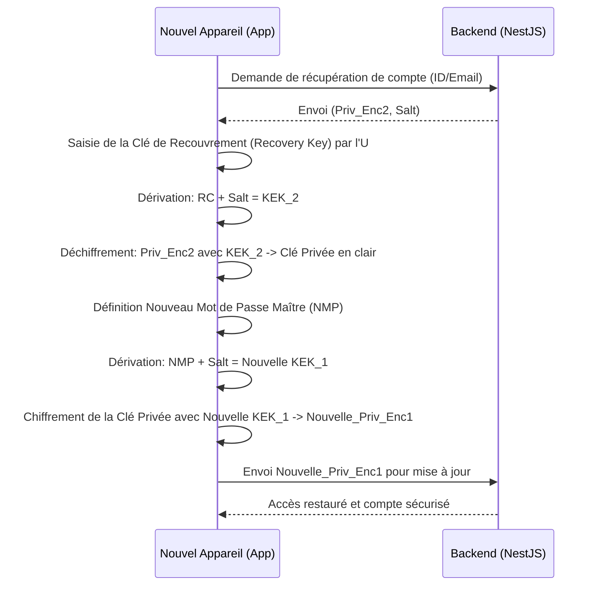

# Schémas des Flux Cryptographiques

## 1. Inscription et Génération des Clés

Ce flux garantit que le serveur ne connaît jamais la clé privée de l'utilisateur. Il intègre la génération de la TEK et de l'arbre initial.

---

## 2. Mise à Jour de l'Arbre (UserTree)

Ce flux illustre comment l'arbre chiffré est mis à jour après chaque opération (upload, création de dossier, etc.).

---

## 3. Upload et Chiffrement d'un Fichier

Ce flux illustre le chiffrement local avant l'envoi sur le cloud public.

---

## 4. Partage d'un Fichier

Ce flux illustre comment le propriétaire partage un fichier sans que le serveur ne voie jamais la FEK en clair.

---

## 5. Récupération de Compte (Perte de Terminal)

Ce flux montre comment un utilisateur récupère son accès s'il perd son appareil et son mot de passe.

