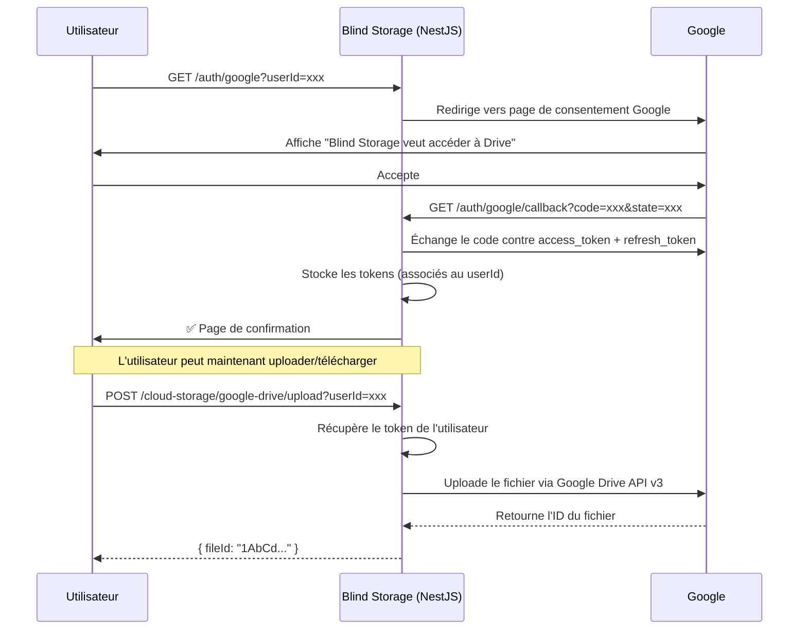

# ☁️ Module Cloud Storage

Module NestJS permettant de stocker, télécharger, lister et supprimer des fichiers sur **Google Drive** et **Dropbox** via leurs APIs officielles.

Dans le contexte de Blind Storage, ce module ne manipule que des **fichiers déjà chiffrés** — il ne voit jamais le contenu en clair.

---

## Sommaire

- [Architecture interne](#architecture-interne)
- [Installation et configuration](#installation-et-configuration)
  - [Configurer Google Drive](#configurer-google-drive)
  - [Configurer Dropbox](#configurer-dropbox)
- [Flow de connexion Google Drive](#flow-de-connexion-google-drive)
- [Endpoints de l'API](#endpoints-de-lapi)
- [Exemples d'utilisation](#exemples-dutilisation)
- [Ajouter un nouveau provider](#ajouter-un-nouveau-provider)

---

## Architecture interne

```
src/
  auth/
    google/
      google-auth.controller.ts   ← Routes OAuth2 (/auth/google/...)
      google-auth.service.ts      ← Gestion des tokens par utilisateur
      google-auth.module.ts       ← Déclaration du module d'auth
  cloud-storage/
    providers/
      cloud-storage-provider.interface.ts   ← Contrat commun aux providers
      google-drive.service.ts               ← Implémentation Google Drive
      dropbox.service.ts                    ← Implémentation Dropbox
    cloud-storage.service.ts               ← Sélectionne le bon provider
    cloud-storage.controller.ts            ← Routes HTTP de stockage
    cloud-storage.module.ts                ← Déclaration du module
```

### Pourquoi un module `auth/google` séparé ?

Google Drive utilise OAuth2 **par utilisateur** : chaque personne connecte son propre compte Google et les fichiers vont dans **son** Drive personnel. Le module `auth/google` gère tout le cycle de vie des tokens (obtention, stockage, renouvellement automatique). `GoogleDriveService` lui demande simplement un client authentifié quand il en a besoin.



---

## Installation et configuration

### 1. Installer les dépendances

```bash
npm install googleapis dropbox @nestjs/config
npm install --save-dev @types/multer
```

### 2. Créer le fichier `.env`

```bash
cp .env.example .env
```

---

### Configurer Google Drive

L'application s'enregistre auprès de Google comme une "OAuth App". Les utilisateurs la connectent à leur compte Google via une page de consentement standard (comme "Se connecter avec Google").

#### Étape 1 — Créer un projet Google Cloud

1. Aller sur [console.cloud.google.com](https://console.cloud.google.com)
2. Cliquer sur **Sélectionner un projet** → **Nouveau projet**
3. Donner un nom (ex: `blind-storage`) et créer

#### Étape 2 — Activer l'API Google Drive

1. Menu → **APIs et services** → **Bibliothèque**
2. Rechercher **Google Drive API** → **Activer**

#### Étape 3 — Configurer l'écran de consentement OAuth

Avant de créer des credentials, Google demande de décrire l'application.

1. Menu → **APIs et services** → **Écran de consentement OAuth**
2. Choisir **Externe** (pour que n'importe qui puisse se connecter) → **Créer**
3. Remplir :
   - **Nom de l'application** : `Blind Storage`
   - **E-mail d'assistance** : votre email
   - **Domaine autorisé** : votre domaine (ex: `blind-storage.fr`) ou laisser vide en dev
4. Cliquer sur **Enregistrer et continuer** jusqu'à la fin

> En mode **Test**, seuls les emails listés dans "Utilisateurs test" peuvent se connecter. Pour un accès public, l'application doit passer en mode **Production** (processus de vérification Google).

#### Étape 4 — Créer les credentials OAuth2

1. Menu → **APIs et services** → **Identifiants**
2. **+ Créer des identifiants** → **ID client OAuth**
3. Type d'application : **Application Web**
4. Nom : `Blind Storage Backend`
5. Dans **URI de redirection autorisés**, ajouter :
   - En développement : `http://localhost:3000/auth/google/callback`
   - En production : `https://votre-domaine.com/auth/google/callback`
6. Cliquer sur **Créer**

Une popup affiche le **Client ID** et le **Client Secret**. Les copier dans le `.env` :

```env
GOOGLE_CLIENT_ID=123456789-abcdefghijklmnopqrstuvwxyz.apps.googleusercontent.com
GOOGLE_CLIENT_SECRET=GOCSPX-xxxxxxxxxxxxxxxxxxxxxxxx
GOOGLE_REDIRECT_URI=http://localhost:3000/auth/google/callback
```

---

### Configurer Dropbox

> **Note :** L'intégration Dropbox actuelle utilise un **token unique** pour toute l'application (les fichiers de tous les utilisateurs vont dans un même compte Dropbox, organisés par dossier). Une implémentation OAuth2 par utilisateur (comme Google Drive) est possible mais n'est pas encore implémentée.

#### Étape 1 — Créer une application Dropbox

1. Aller sur [dropbox.com/developers/apps](https://www.dropbox.com/developers/apps)
2. Cliquer sur **Create app**
3. Choisir **Scoped access** → **Full Dropbox**
4. Donner un nom (ex: `blind-storage`) → **Create app**

#### Étape 2 — Configurer les permissions

Dans l'onglet **Permissions**, cocher :
- `files.content.read`
- `files.content.write`

Cliquer sur **Submit**.

#### Étape 3 — Générer un Access Token

Dans l'onglet **Settings** → section **OAuth 2** → cliquer sur **Generate** sous *Generated access token*.

```env
DROPBOX_ACCESS_TOKEN=sl.xxxxxxxxxxxxxxxxxxxxxxxxxxxxxxxxxxxxxxxx
```

---

## Flow de connexion Google Drive

Avant de pouvoir stocker des fichiers sur Google Drive, chaque utilisateur doit connecter son compte Google **une seule fois**.

### 1. L'utilisateur se connecte

Ouvrir cette URL dans un navigateur (ou la faire ouvrir par l'application cliente) :

```
GET http://localhost:3000/auth/google?userId=<identifiant-utilisateur>
```

Le serveur redirige automatiquement vers la page de consentement Google.

### 2. L'utilisateur accepte

Google affiche : *"Blind Storage veut accéder à vos fichiers Google Drive"*.
Après acceptation, Google redirige vers le callback — la page affiche une confirmation.

### 3. Vérifier le statut de connexion

```
GET http://localhost:3000/auth/google/status?userId=<identifiant-utilisateur>
```

```json
{ "userId": "mon-user", "connected": true }
```

### 4. Déconnecter un utilisateur

```
DELETE http://localhost:3000/auth/google/disconnect?userId=<identifiant-utilisateur>
```

---

## Endpoints de l'API

Le paramètre `:provider` accepte `google-drive` ou `dropbox`.

### Lister les fichiers

```
GET /cloud-storage/:provider/files?userId=<userId>
```

```json
{
  "files": [
    {
      "id": "1AbCdEfGhIjKlMnOpQrStUvWxYz",
      "name": "document.enc",
      "size": 4096,
      "createdAt": "2025-01-15T10:30:00.000Z",
      "mimeType": "application/octet-stream"
    }
  ]
}
```

### Uploader un fichier

```
POST /cloud-storage/:provider/upload?userId=<userId>
Content-Type: multipart/form-data
```

Le fichier doit être dans un champ nommé **`file`**.

```json
{
  "fileId": "1AbCdEfGhIjKlMnOpQrStUvWxYz",
  "message": "Fichier uploadé avec succès"
}
```

> Conserver le `fileId` — il est nécessaire pour télécharger ou supprimer le fichier.

### Télécharger un fichier

```
GET /cloud-storage/:provider/download/:fileId?userId=<userId>
```

Réponse : contenu brut du fichier (`application/octet-stream`).

### Supprimer un fichier

```
DELETE /cloud-storage/:provider/files/:fileId?userId=<userId>
```

Réponse : `204 No Content`

---

## Exemples d'utilisation

### 1. Connecter un utilisateur à Google Drive

Ouvrir dans un navigateur :
```
http://localhost:3000/auth/google?userId=user-abc123
```

### 2. Uploader un fichier chiffré

```bash
curl -X POST "http://localhost:3000/cloud-storage/google-drive/upload?userId=user-abc123" \
  -F "file=@/chemin/vers/fichier.enc"
```

### 3. Lister les fichiers

```bash
curl "http://localhost:3000/cloud-storage/google-drive/files?userId=user-abc123"
```

### 4. Télécharger un fichier

```bash
curl "http://localhost:3000/cloud-storage/google-drive/download/1AbCdEfGhIjKlMnOpQrStUvWxYz?userId=user-abc123" \
  -o fichier_recupere.enc
```

### 5. Supprimer un fichier

```bash
curl -X DELETE "http://localhost:3000/cloud-storage/google-drive/files/1AbCdEfGhIjKlMnOpQrStUvWxYz?userId=user-abc123"
```

---

## Ajouter un nouveau provider

Pour ajouter un provider (ex: OneDrive), 3 étapes :

**1.** Créer `providers/onedrive.service.ts` en implémentant l'interface :

```typescript
@Injectable()
export class OneDriveService implements CloudStorageProvider {
  async uploadFile(fileName, fileBuffer, mimeType, userId): Promise<string> { ... }
  async downloadFile(fileId, userId): Promise<Buffer> { ... }
  async deleteFile(fileId, userId): Promise<void> { ... }
  async listFiles(userId): Promise<FileMetadata[]> { ... }
}
```

**2.** L'enregistrer dans `cloud-storage.module.ts` :

```typescript
providers: [CloudStorageService, GoogleDriveService, DropboxService, OneDriveService],
```

**3.** L'ajouter dans `cloud-storage.service.ts` :

```typescript
case 'onedrive':
  return this.oneDriveService;
```

---

## Note sur la persistance des tokens

Les tokens OAuth2 Google sont actuellement stockés **en mémoire** dans `GoogleAuthService`. Ils sont perdus au redémarrage du serveur — les utilisateurs devront se reconnecter.

En production, les persister en base de données (PostgreSQL via Prisma) dans une table `user_tokens` :

```
userId | provider     | accessToken | refreshToken | expiryDate
-------|--------------|-------------|--------------|------------
abc123 | google-drive | ya29.xxx    | 1//xxx       | 1735000000
```
